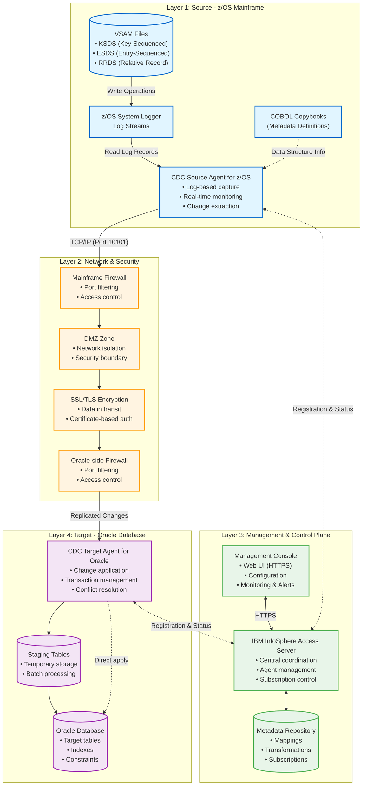
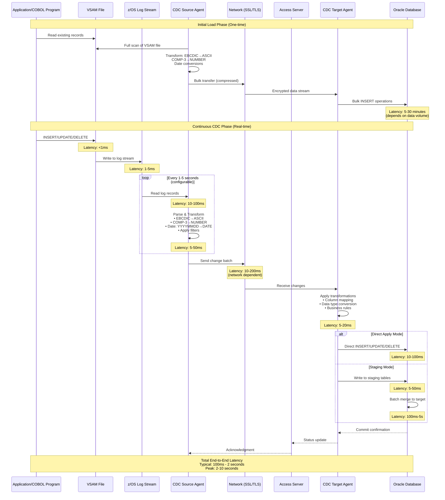
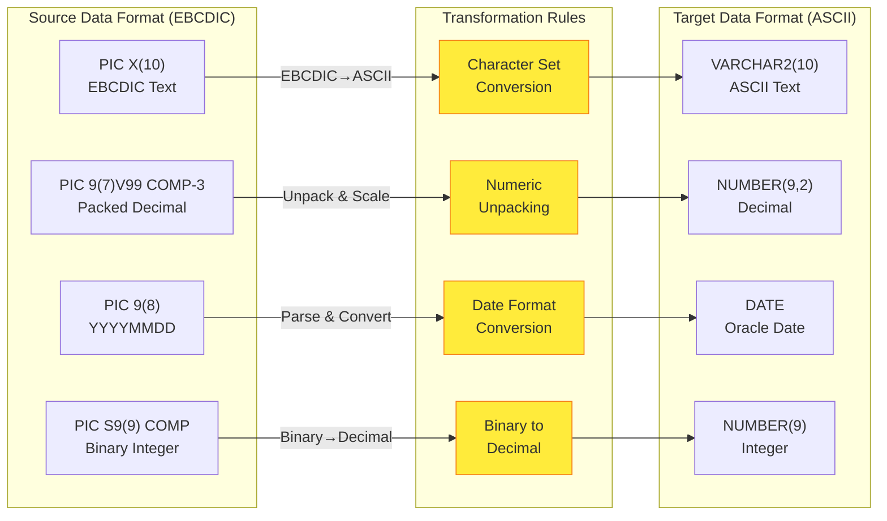

# IBM CDC Architecture: VSAM to Oracle Database

## Overview
This document provides a comprehensive architecture diagram for IBM InfoSphere Data Replication CDC (Change Data Capture) solution that converts VSAM files from z/OS mainframe to Oracle Database.

---

## 1. High-Level Architecture Diagram

### Architecture Legend

| Color | Layer | Description |
|-------|-------|-------------|
| 🔵 Blue | Source Layer | z/OS mainframe components and VSAM files |
| 🟠 Orange | Network & Security | Firewalls, encryption, and network infrastructure |
| 🟢 Green | Management & Control | Central coordination and monitoring |
| 🟣 Purple | Target Layer | Oracle database and CDC target components |

---

## 2. Detailed Data Flow Sequence Diagram

---

## 3. Data Transformation Flow

---

## 4. Component Descriptions

### Layer 1: Source - z/OS Mainframe

#### VSAM Files
Virtual Storage Access Method (VSAM) files are the primary data storage mechanism on z/OS mainframes. CDC supports three types:
- **KSDS (Key-Sequenced Data Set)**: Records organized by key, similar to indexed files
- **ESDS (Entry-Sequenced Data Set)**: Records stored in order of insertion
- **RRDS (Relative Record Data Set)**: Records accessed by relative position

#### z/OS System Logger / Log Streams
The System Logger captures all VSAM file changes in real-time, writing them to log streams. This provides a non-intrusive method for CDC to capture changes without impacting application performance. Log streams are circular buffers that maintain a rolling window of changes.

#### COBOL Copybooks
Copybooks define the data structure and layout of VSAM records. CDC uses these metadata definitions to understand field positions, data types (COMP-3, COMP, DISPLAY), and lengths. This is critical for accurate data parsing and transformation.

#### CDC Source Agent for z/OS
The source agent is a native z/OS application that:
- Reads log streams continuously for VSAM changes
- Parses records using copybook definitions
- Performs initial data transformations (EBCDIC to ASCII)
- Buffers changes for efficient network transmission
- Maintains replication state and checkpoints

### Layer 2: Network & Security

#### Firewalls (Mainframe & Oracle Side)
Enterprise-grade firewalls protect both the mainframe and Oracle environments. They enforce:
- Port-based access control (typically TCP port 10101 for CDC)
- IP address whitelisting
- Protocol inspection
- Intrusion detection and prevention

#### DMZ (Demilitarized Zone)
A network security zone that acts as a buffer between the mainframe and target systems. It provides an additional layer of isolation and security monitoring, ensuring that compromised systems in one zone cannot directly access the other.

#### SSL/TLS Encryption
All data transmitted between CDC agents is encrypted using industry-standard SSL/TLS protocols. This includes:
- Certificate-based mutual authentication
- AES-256 encryption for data in transit
- Perfect forward secrecy
- Regular certificate rotation

### Layer 3: Management & Control Plane

#### IBM InfoSphere Access Server
The central coordination hub for the entire CDC infrastructure. It:
- Manages agent registration and health monitoring
- Coordinates subscriptions (replication definitions)
- Handles failover and high availability
- Provides centralized logging and auditing
- Stores configuration and metadata

#### Management Console
A web-based interface (typically accessed via HTTPS) that allows administrators to:
- Configure source and target connections
- Define table mappings and transformations
- Monitor replication status and performance metrics
- Set up alerts and notifications
- View historical statistics and trends

#### Metadata Repository
A database (often DB2 or Oracle) that stores:
- Source-to-target table mappings
- Column-level transformation rules
- Subscription definitions and schedules
- User permissions and security settings
- Audit logs and change history

### Layer 4: Target - Oracle Database

#### CDC Target Agent for Oracle
The target agent is a Java-based application that:
- Receives change data from the source agent
- Applies additional transformations as needed
- Manages transaction ordering and consistency
- Handles conflict resolution (for bidirectional replication)
- Optimizes batch operations for performance

#### Staging Tables
Temporary tables used for:
- Buffering incoming changes during high-volume periods
- Performing complex transformations that require SQL operations
- Enabling batch merge operations for better performance
- Providing a recovery point in case of failures

#### Oracle Database
The final destination for replicated data. CDC ensures:
- Transactional consistency (ACID properties maintained)
- Referential integrity (foreign keys respected)
- Proper index maintenance
- Minimal impact on production workloads

---

## 5. Replication Modes

### Initial Load
A one-time bulk transfer of existing VSAM data to Oracle:
- **Duration**: 5 minutes to several hours (depends on data volume)
- **Method**: Full table scan of VSAM files
- **Network**: Compressed data transfer to minimize bandwidth
- **Target**: Bulk INSERT operations with disabled indexes (re-enabled after load)

### Continuous CDC (Change Data Capture)
Real-time replication of ongoing changes:
- **Latency**: Typically 100ms to 2 seconds end-to-end
- **Method**: Log-based capture from z/OS log streams
- **Frequency**: Configurable (1-5 second intervals typical)
- **Operations**: INSERT, UPDATE, DELETE replicated as they occur

---

## 6. Key Technical Specifications

| Aspect | Specification |
|--------|---------------|
| **Network Protocol** | TCP/IP over SSL/TLS |
| **Default Port** | 10101 (configurable) |
| **Encryption** | AES-256, TLS 1.2+ |
| **Typical Latency** | 100ms - 2 seconds |
| **Peak Latency** | 2-10 seconds (under load) |
| **Throughput** | Up to 100,000 transactions/second |
| **Data Transformations** | EBCDIC↔ASCII, COMP-3→NUMBER, Date conversions |
| **Supported VSAM Types** | KSDS, ESDS, RRDS |
| **High Availability** | Active-passive failover, automatic recovery |

---

## 7. Performance Considerations

### Factors Affecting Latency
1. **Network bandwidth and latency** (10-200ms)
2. **Source agent processing** (5-50ms per batch)
3. **Target agent processing** (5-20ms per batch)
4. **Oracle commit time** (10-100ms)
5. **Log stream read frequency** (configurable, 1-5 seconds)

### Optimization Strategies
- **Batch size tuning**: Larger batches reduce overhead but increase latency
- **Parallel processing**: Multiple subscriptions can run concurrently
- **Staging tables**: Use for high-volume scenarios to buffer changes
- **Index management**: Disable during initial load, optimize for CDC operations
- **Network optimization**: Dedicated network links, compression enabled

---

## 8. Security Features

### Authentication & Authorization
- Certificate-based mutual authentication between agents
- Role-based access control (RBAC) in Management Console
- Integration with enterprise identity management (LDAP/Active Directory)
- Encrypted credential storage

### Data Protection
- End-to-end encryption (data at rest and in transit)
- Audit logging of all configuration changes
- Data masking capabilities for sensitive fields
- Compliance with regulatory requirements (GDPR, HIPAA, etc.)

### Network Security
- Firewall rules limiting access to specific IP ranges
- DMZ isolation preventing direct mainframe access
- Intrusion detection and prevention systems
- Regular security patching and updates

---

## 9. Monitoring & Alerting

### Key Metrics
- **Replication lag**: Time difference between source change and target apply
- **Throughput**: Transactions per second
- **Error rate**: Failed transactions requiring manual intervention
- **Agent health**: CPU, memory, network utilization
- **Queue depth**: Backlog of pending changes

### Alert Conditions
- Replication lag exceeds threshold (e.g., > 5 seconds)
- Agent disconnection or failure
- High error rate (e.g., > 1% of transactions)
- Resource exhaustion (disk space, memory)
- Security events (authentication failures, unauthorized access)

---

## 10. Disaster Recovery & High Availability

### Failover Capabilities
- **Active-passive agent configuration**: Standby agents ready to take over
- **Automatic failover**: Triggered by health checks and heartbeat monitoring
- **State preservation**: Replication position maintained for seamless recovery
- **Geographic redundancy**: Agents can be distributed across data centers

### Recovery Procedures
1. **Checkpoint recovery**: Resume from last committed position
2. **Log stream replay**: Re-process missed changes from log streams
3. **Resynchronization**: Compare source and target, apply differences
4. **Manual intervention**: For complex scenarios requiring human judgment

---

## Conclusion

This architecture provides a robust, secure, and high-performance solution for replicating VSAM data from z/OS mainframes to Oracle databases. The log-based CDC approach ensures minimal impact on source systems while maintaining near real-time data synchronization with comprehensive transformation capabilities.

The layered architecture separates concerns (source, network, management, target) and provides multiple points for monitoring, security enforcement, and optimization. With proper configuration and tuning, this solution can handle enterprise-scale workloads with sub-second latency and high reliability.